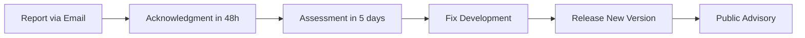

# 🔒 Security Policy

## Reporting a Vulnerability

If you discover a security vulnerability in Story Development Toolkit, please report it responsibly.

### 📧 How to Report

**Do NOT create a public issue for security vulnerabilities.**

Instead, please email the maintainer directly:

📧 **Email:** [miladvf2014@gmail.com](mailto:miladvf2014@gmail.com)

### 📋 What to Include

Please include the following information:

- **Description:** Clear description of the vulnerability
- **Steps to Reproduce:** How to trigger the issue
- **Impact:** What an attacker could do
- **Affected Versions:** Which versions are affected
- **Suggested Fix:** Optional, if you have one in mind

### ⏱️ Response Time

| Stage | Timeline |
|-------|----------|
| Acknowledgment | Within 48 hours |
| Assessment | Within 5 business days |
| Fix Released | Within 30 days (depending on severity) |

---

## 🔐 Our Commitment

We take security seriously and will:

- 🕐 Respond promptly to reports
- 🔒 Keep reports confidential
- 🏆 Credit reporters (if desired)
- 📢 Announce fixed vulnerabilities responsibly
- 🛡️ Not take legal action against responsible reporters

---

## 📊 Severity Levels

| Level | Description | Response |
|-------|-------------|----------|
| 🔴 **Critical** | Remote code execution, data exposure | Immediate |
| 🟠 **High** | Authentication bypass, privilege escalation | 48 hours |
| 🟡 **Medium** | Information disclosure, CSRF | 1 week |
| 🟢 **Low** | Minor issues, best practices | Next release |

---

## ✅ Supported Versions

| Version | Supported | Status |
|---------|:---------:|--------|
| **2.2.2** | ✅ | **Current release** |
| 2.2.1 | ✅ | Security updates only |
| 2.2.0 | ✅ | Security updates only |
| 2.1.0 | ✅ | Security updates only |
| 2.0.0 | ✅ | Security updates only |
| 1.0.0 | ⚠️ | Limited support |
| < 1.0.0 | ❌ | Not supported |

---

## 🔐 Security Features in v2.2.2

| Feature | Description |
|---------|-------------|
| **Local-First** | No external API calls required for core features |
| **API Key Protection** | LLM API keys are never stored in logs |
| **SQLite Safety** | Prepared statements prevent injection |
| **Input Validation** | All user inputs are validated |
| **Safe File Operations** | File paths are sanitized |

---

## 🛡️ Security Best Practices

### For LLM Backend Users

```python
# ✅ DO: Use environment variables for API keys
import os
os.environ["OPENAI_API_KEY"] = "sk-..."

# ❌ DON'T: Hardcode API keys
# api_key = "sk-12345..."  # Never do this!
```

### For Memory Storage

```python
# ✅ DO: Keep database file in a secure location
toolkit = StoryToolkit(memory_backend="sqlite", db_path="secure/stories.db")

# ❌ DON'T: Use publicly accessible paths
# toolkit = StoryToolkit(memory_backend="sqlite", db_path="C:/temp/stories.db")
```

### For Exported Files

```python
# ✅ DO: Validate output paths
import os
output_path = os.path.abspath("my_story.pdf")

# ❌ DON'T: Accept user input directly
# exporter.export(story, user_provided_filename)
```

---

## 🔍 Dependency Security

We regularly monitor dependencies for known vulnerabilities:

| Package | Version | Status |
|---------|---------|--------|
| `nltk` | >=3.8.1 | ✅ Secure |
| `spacy` | >=3.7.0 | ✅ Secure |
| `textblob` | >=0.17.1 | ✅ Secure |
| `pydantic` | >=2.5.0 | ✅ Secure |
| `pyyaml` | >=6.0 | ✅ Secure |
| `openai` (optional) | >=1.0.0 | ✅ Secure |
| `anthropic` (optional) | >=0.18.0 | ✅ Secure |
| `ollama` (optional) | >=0.1.0 | ✅ Secure |
| `reportlab` (optional) | >=4.0 | ✅ Secure |
| `ebooklib` (optional) | >=0.18 | ✅ Secure |

---

## 📝 Disclosure Policy

When a vulnerability is confirmed:

1. A fix will be developed and tested
2. A security advisory will be published on GitHub
3. The fix will be released in a new version
4. Credit will be given to the reporter (unless anonymity is requested)

---

## 🏆 Hall of Fame

We appreciate and recognize security researchers who responsibly disclose vulnerabilities.

| Reporter | Vulnerability | Version | Date |
|----------|---------------|---------|------|
| — | — | — | — |

*Be the first to be listed here!*

---

## 🔄 Reporting Process



---

## 📜 Changelog Security Updates

| Version | Security Fixes | Date |
|---------|----------------|------|
| 2.2.2 | Input validation improvements | May 8, 2026 |
| 2.2.1 | Template injection prevention | May 8, 2026 |
| 2.1.0 | SQL injection prevention | May 8, 2026 |
| 2.0.0 | API key handling improvements | May 7, 2026 |
| 1.0.0 | Initial security implementation | May 7, 2026 |

---

## 📄 License

This security policy is part of the Story Development Toolkit project, licensed under MIT.

---

## 📞 Contact

- **Security Reports:** [miladvf2014@gmail.com](mailto:miladvf2014@gmail.com)
- **GitHub Security Advisories:** [github.com/miladrezanezhad/story-toolkit/security](https://github.com/miladrezanezhad/story-toolkit/security)

---

*Thank you for helping keep Story Development Toolkit secure!* 🔒
